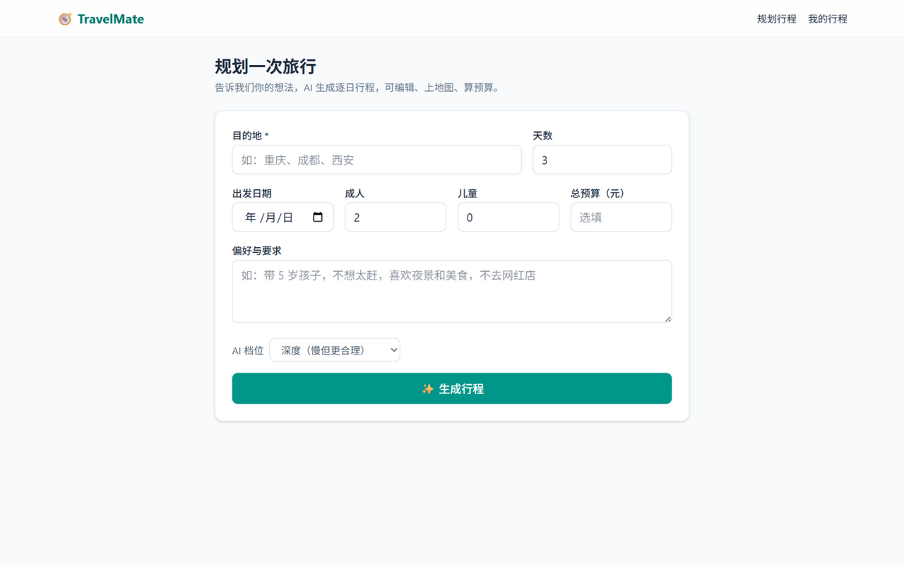
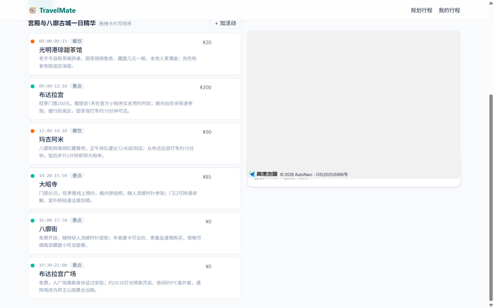
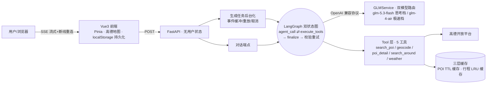

# TravelMate · 对话式旅行规划 Agent

> 一句话：你说「带 5 岁孩子杭州玩两天」，AI 排出逐日行程（几点去哪、吃什么、花多少钱），渲染在地图上，之后还能随时聊天改行程。





## 它能做什么

- **自然语言生成行程**：目的地/天数/人数/预算/偏好 → 逐日活动（时段、费用、实用备注），三档速度可选（极速 / 快速 / 深度思考）
- **真实地理数据**：每个地点的坐标、天气、营业时间、评分由 Agent 现场调用高德 API 获取——**行程坐标 100% 来自工具返回，杜绝 LLM 编造**
- **多轮对话修改**：「第二天太累了」「把这家餐厅换成素食」→ 只重排受影响的天，version+1，可撤销
- **可视化与编辑**：高德地图动线（Marker 按类型着色、卡片↔地图双向联动）、时间线行内编辑/拖拽、实时预算
- **偏好记忆**：一句「以后都吃素」被自动抽取为跨行程偏好档案，下次生成自动生效
- **可靠体验**：AI 思考过程全程流式可见；生成中刷新/断网页面不丢行程（后台任务 + 事件重放）

## 架构



**核心设计**：「LLM 决策 + 工具获取事实 + 代码校验」——模型自主决定调什么工具、调几次（失败会换关键词重查），但输出必须通过确定性校验器（时段冲突 / 未定位率>30% 熔断 / 超预算），不合格带反馈自动重试。

## 实测数据（可复现）

| 指标 | 结果 |
|---|---|
| 3 天行程生成（极速档） | **48.5s**（思考档约 8-10 分钟） |
| 相似请求缓存命中 | **0.27s**（首次 31.1s，约 115×） |
| 批量并行定位 | 10 地点 **1s 内**完成 |
| 瓶颈归因 | 95% 耗时在模型流式输出（SSE 事件时间戳分析） |
| 自动化测试 | 155 项（后端 132 + 前端 23，全离线） |

## 快速开始

需要两个 Key：[智谱 GLM](https://open.bigmodel.cn)（模型 glm-5.3-flash / glm-4-air）、[高德 Web 服务 Key](https://console.amap.com)。

**方式一：Windows 一键**——双击 `start.bat`（首次自动装环境并启动）。

**方式二：手动**

```bash
# 后端（:8000）
cd backend && cp .env.example .env   # 填 GLM_API_KEY、AMAP_WEB_KEY
python -m venv .venv && .venv/Scripts/python -m pip install -e ".[dev]"
.venv/Scripts/python -m uvicorn app.main:app --port 8000

# 前端（:5173，/api 自动代理到 8000）
cd frontend && cp .env.example .env  # 填高德 JS API Key（可选，无 Key 时地图降级）
npm install && npm run dev
```

**方式三：Docker**——`docker compose up`（编排文件已含 nginx SSE 反代配置）。

测试：

```bash
cd backend && .venv/Scripts/python -m pytest -q    # 132 项离线测试
cd frontend && npm test                             # 23 项
```

## Agent 质量评估

自建 Evaluation 体系（`backend/evals/`）：18 个对话场景 × 四维自动评分（意图识别 / 工具选择 / 参数正确性 / **坐标幻觉**——行程中每个新坐标必须出现在工具返回集合中）。运行 `python -m evals.run` 生成 `evals/report.md`。

## 更多文档

- [设计 spec（V1→V7 演进路线）](docs/superpowers/specs/2026-09-06-travel-assistant-design.md)
- [实施计划存档](docs/superpowers/plans/)
- [后端](backend/README.md) / [前端](frontend/README.md) 详细说明
